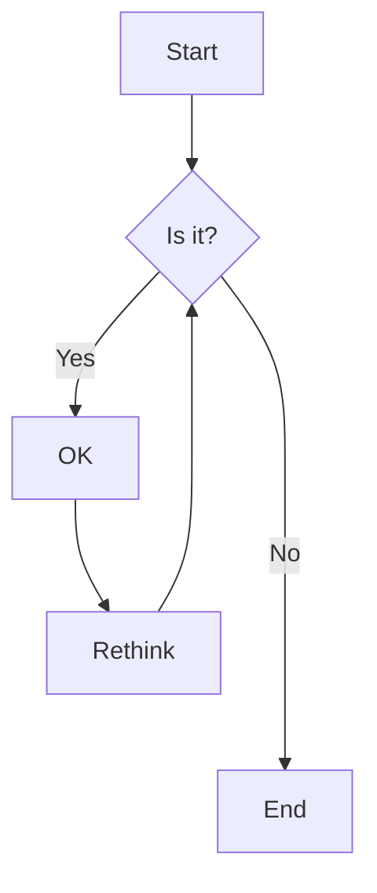
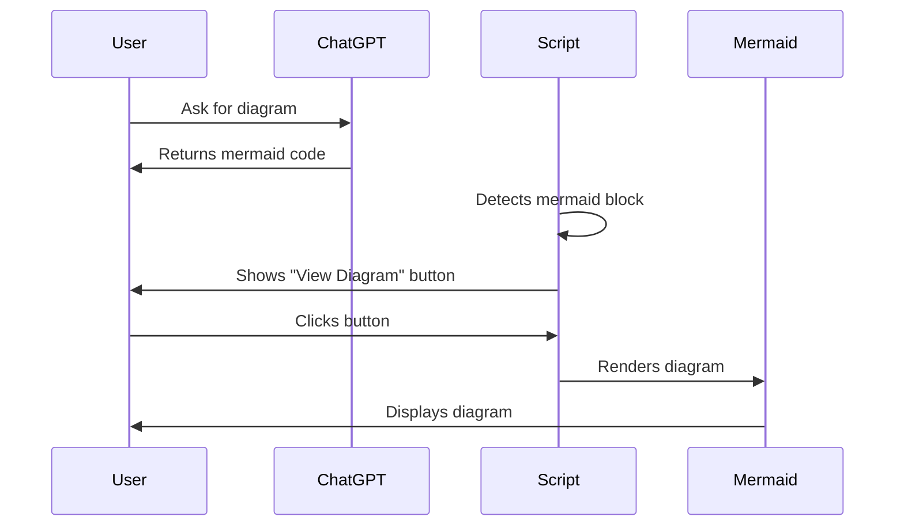
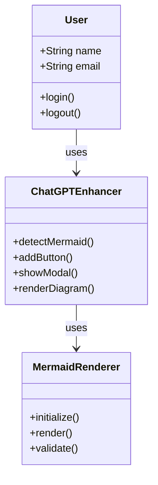
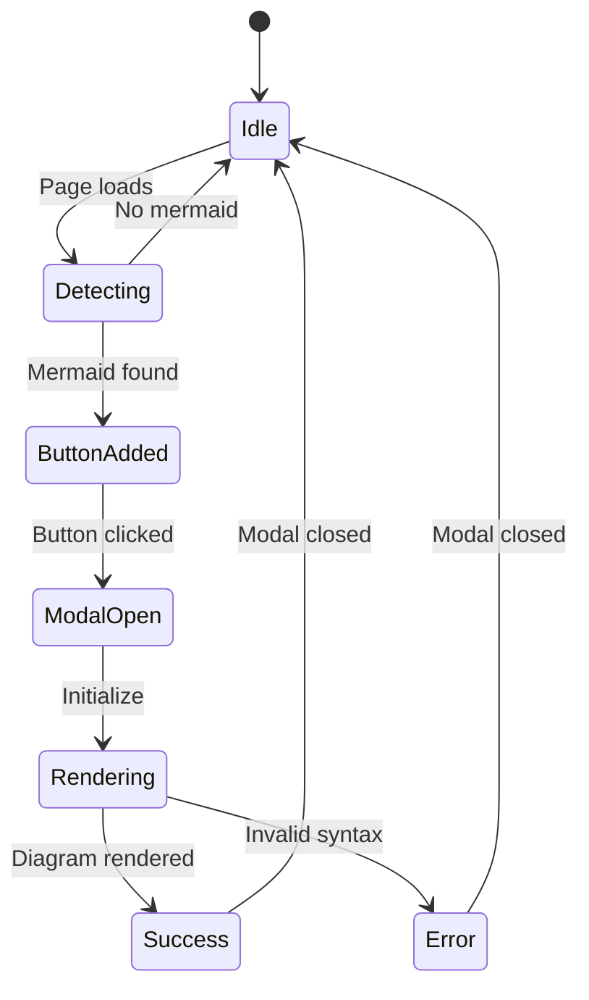
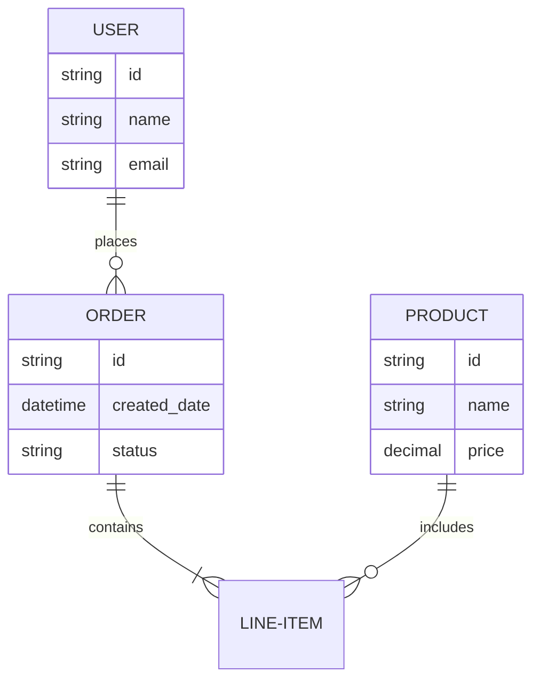
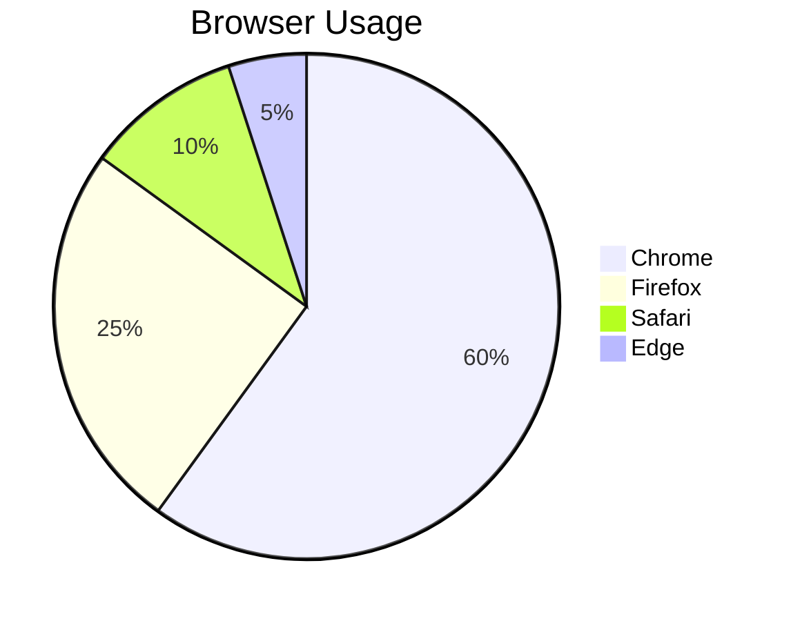
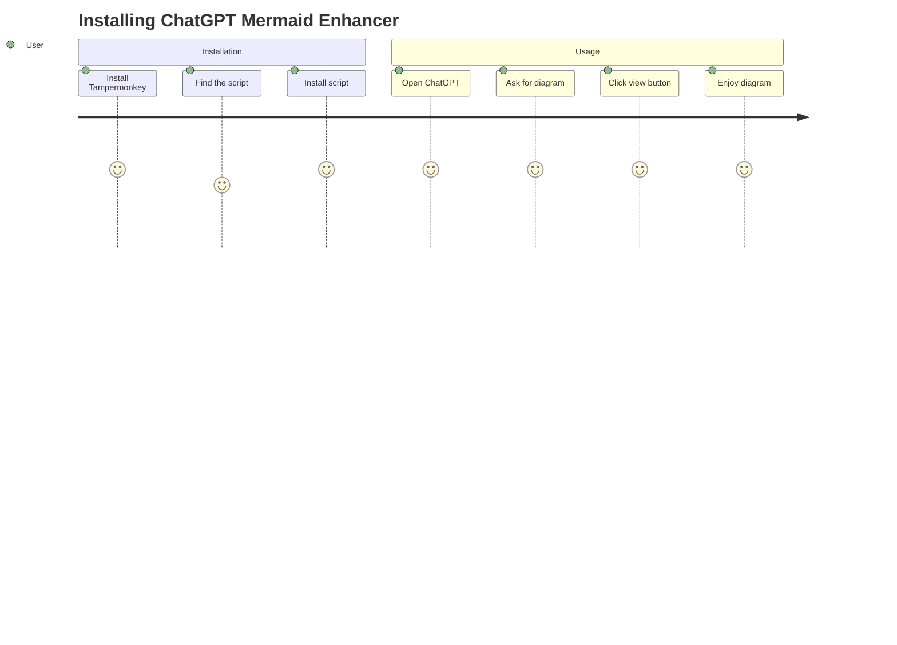
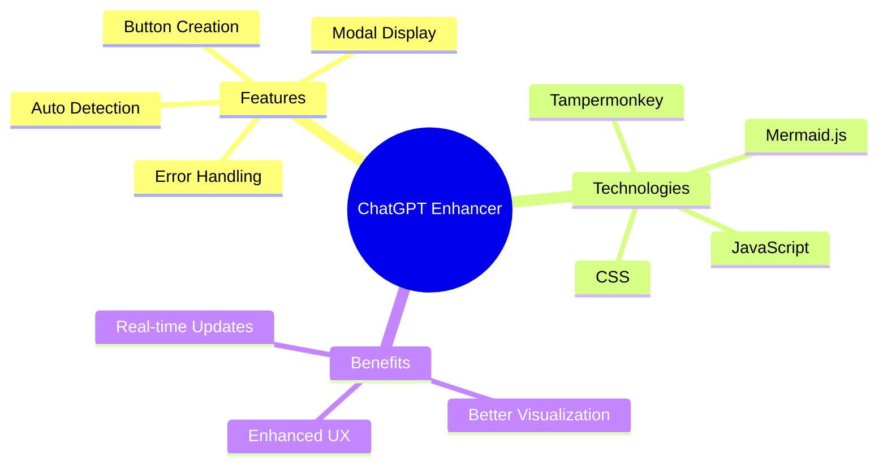
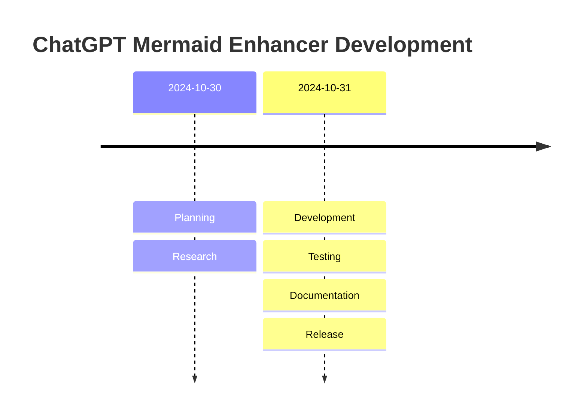

# Mermaid Diagram Examples

This file contains example Mermaid diagrams you can use to test the ChatGPT Mermaid Enhancer script.

## Basic Flowchart



## Sequence Diagram



## Class Diagram



## State Diagram



## Entity Relationship Diagram



## Simple Pie Chart



## Git Graph

```mermaid
gitgraph
    commit
    commit
    branch develop
    commit
    commit
    checkout main
    commit
    merge develop
    commit
```

## User Journey



## Mindmap



## Simple Timeline



---

## How to Test

1. Copy any of the above examples
2. Paste them into ChatGPT and ask ChatGPT to create a similar diagram
3. Look for the "📊 View Diagram" button next to the code block
4. Click the button to see the rendered diagram

## Pro Tips

- Ask ChatGPT to explain the diagram syntax
- Request modifications to existing diagrams
- Combine multiple diagram types in one conversation
- Use descriptive titles and labels for clarity